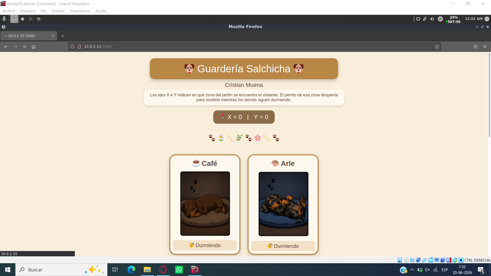
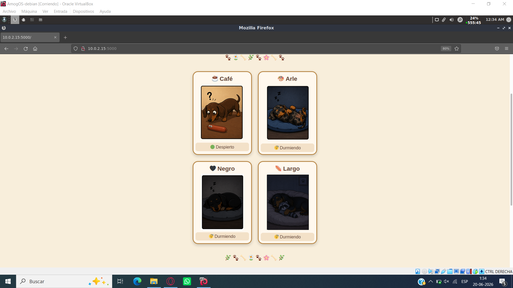
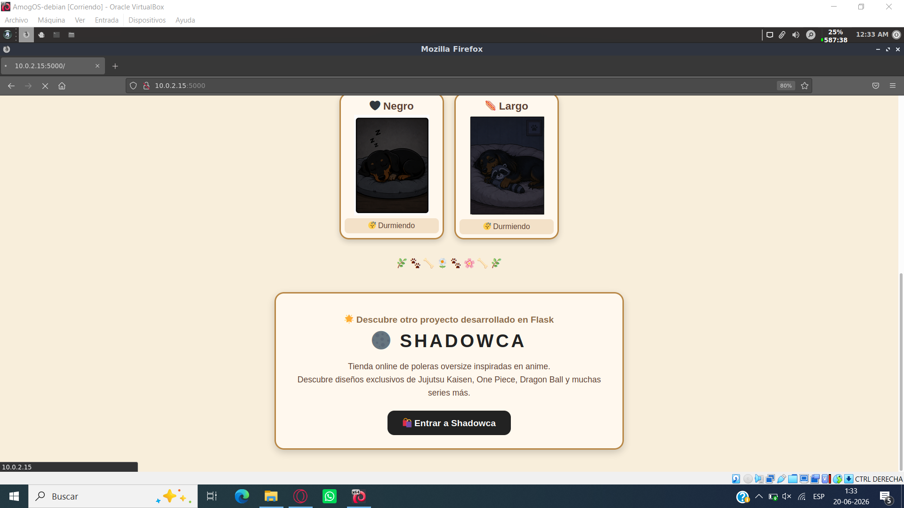
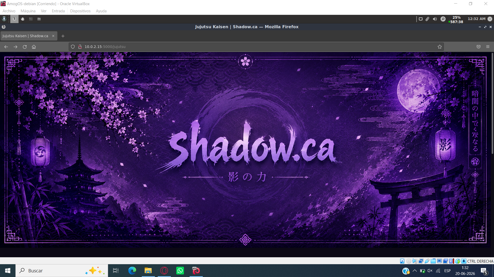
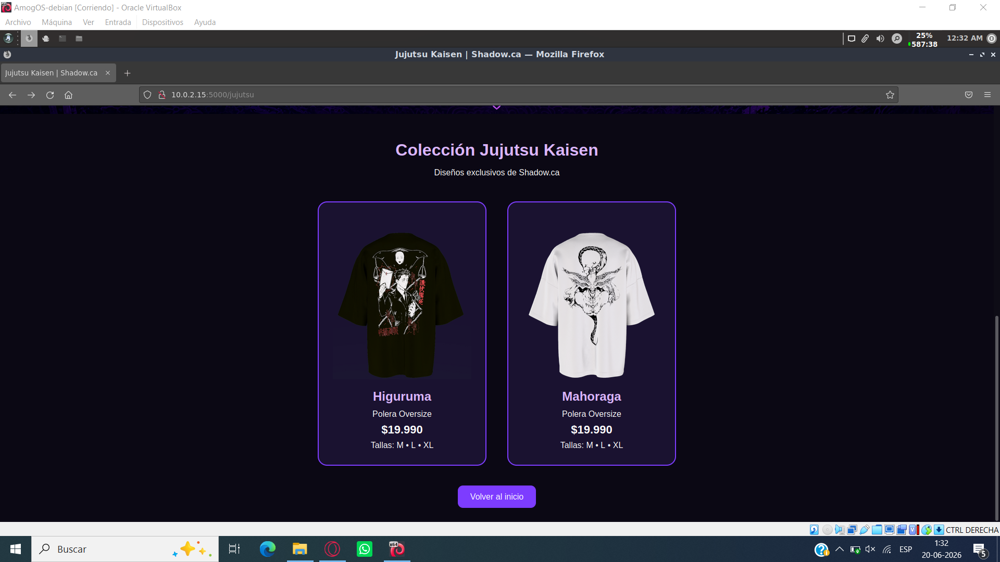
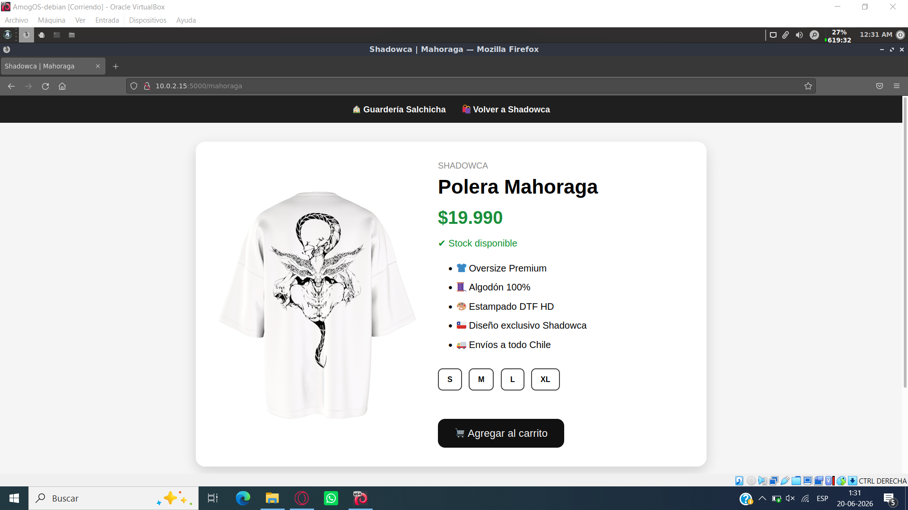

# Guardería Salchicha + Shadowca

Proyecto desarrollado para la asignatura **Desarrollo de Software para Hardware**, utilizando **Python**, **Flask**, **HTML**, **CSS**, **Jinja2** y **Sockets TCP**.

La aplicación recibe en tiempo real las coordenadas **X** e **Y** enviadas por un sensor mediante comunicación TCP. Dependiendo del cuadrante detectado, el perro salchicha correspondiente cambia de estado (durmiendo o despierto), representando visualmente la posición detectada.

Como parte de la actividad también se desarrolló una segunda sección denominada **Shadowca**, una tienda virtual de poleras inspiradas en anime, incorporando navegación entre múltiples páginas utilizando Flask.

---

# Objetivos

- Leer datos enviados por un sensor mediante sockets TCP.
- Mostrar los valores de los ejes X e Y en una interfaz web.
- Identificar el cuadrante correspondiente.
- Actualizar automáticamente la información cada 2 segundos.
- Personalizar completamente la interfaz original.
- Implementar navegación entre múltiples páginas utilizando Flask.

---

# Tecnologías utilizadas

- Python 3
- Flask
- HTML5
- CSS3
- Jinja2
- Socket TCP

---

# Funcionamiento

## Página principal

La página principal muestra los valores X e Y recibidos desde el sensor y los cuatro perros salchicha que representan cada cuadrante.



---

## Estado inicial

Cuando no existe una detección, todos los perros permanecen durmiendo.


---

## Detección de movimiento

Cuando el sensor detecta un cuadrante, únicamente el perro correspondiente cambia a su estado despierto.



---

## Acceso a Shadowca

Desde la página principal es posible acceder a la segunda aplicación desarrollada con Flask.



---

# Shadowca

Shadowca corresponde a una tienda virtual de poleras oversize inspiradas en anime.

## Banner principal



---

## Catálogo de productos

La tienda muestra las poleras disponibles y permite acceder a una página individual del producto.



---

## Página del producto

La polera de Mahoraga cuenta con una página propia donde se presenta información más detallada.



---

# Estructura del proyecto

```text
trabajo/
│
├── app.py
│
├── templates/
│   ├── index.html
│   ├── jujutsu.html
│   └── mahoraga.html
│
├── static/
│   └── imagenes/
│       ├── cafe.png
│       ├── cafed.png
│       ├── arle.png
│       ├── arled.png
│       ├── negro.png
│       ├── negrod.png
│       ├── largo.png
│       ├── largod.png
│       ├── banner.png
│       ├── higu.png
│       └── maho.png
│
├── imagenesREADME/
│   ├── inicioperro.png
│   ├── todoperros.png
│   ├── perrodespierto.png
│   ├── botonshadow.png
│   ├── bannershadow.png
│   ├── shadowca.png
│   └── mahoraga.png
│
└── README.md
```

---

# Mejoras implementadas

En comparación con la versión base de la actividad, se realizaron las siguientes mejoras:

- Rediseño completo de la interfaz gráfica.
- Temática basada en perros salchicha.
- Reemplazo de los cuadrantes por ilustraciones personalizadas.
- Cambio dinámico entre estado durmiendo y despierto según la posición detectada.
- Incorporación de una segunda sección denominada Shadowca.
- Implementación de navegación entre múltiples páginas utilizando Flask.
- Desarrollo de una página individual para el producto Mahoraga.
- Organización del proyecto con una estructura más completa y amigable para el usuario.